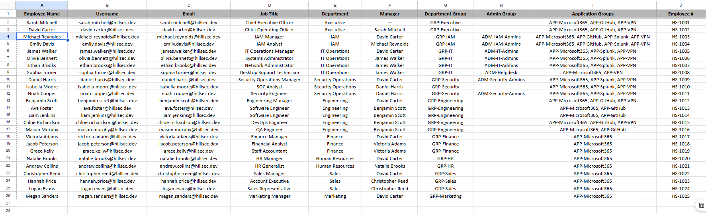
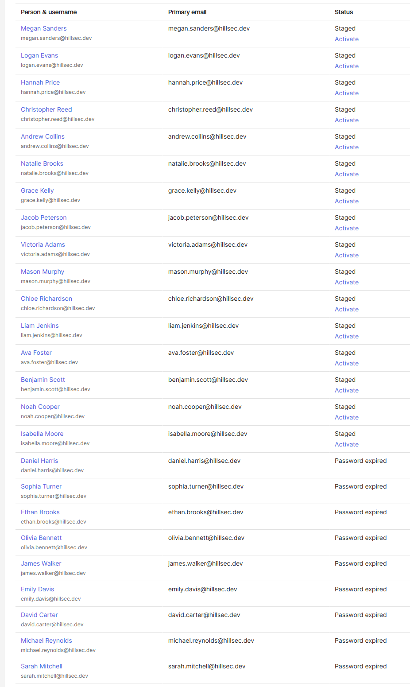
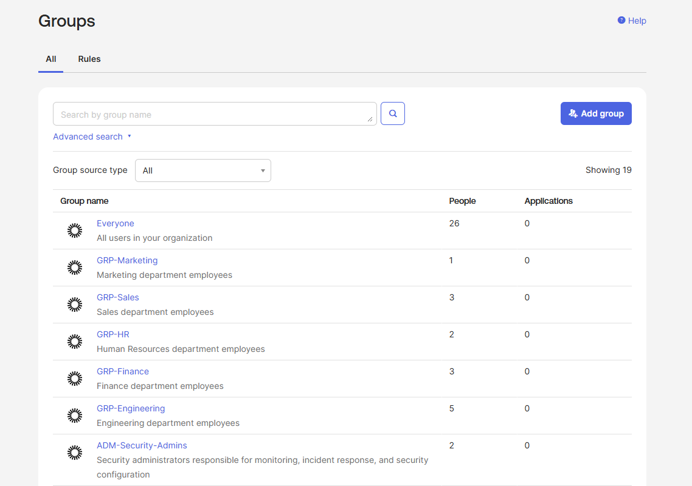
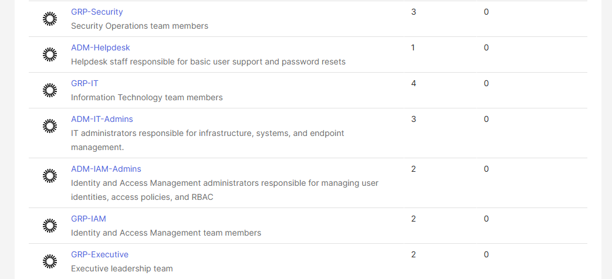
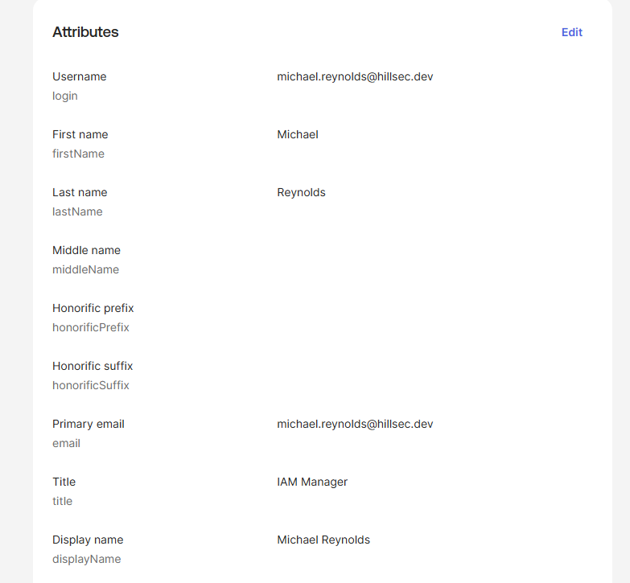
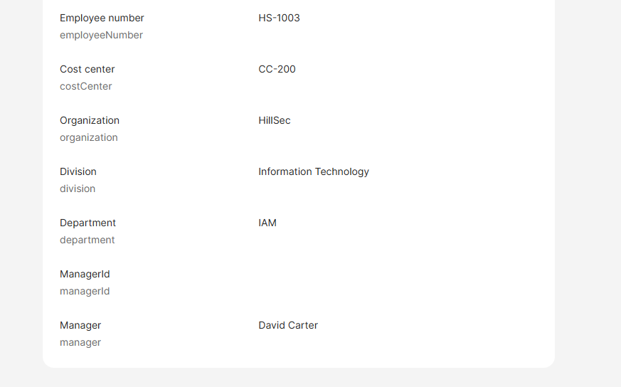

# Phase 4 – Identity Lifecycle Management

## Executive Summary

This phase focused on implementing the HillSec workforce within Okta by provisioning user identities, applying standardized identity attributes, assigning users to role-based access control (RBAC) groups, and establishing user lifecycle states.

Prior to implementation, a complete identity provisioning plan was developed to define organizational structure, user attributes, reporting relationships, RBAC assignments, and application access requirements. This planning-first approach ensured consistent identity creation and reduced configuration errors during provisioning.

The completed identity directory provides the foundation for authentication, authorization, enterprise application integration, and hybrid identity scenarios implemented in later phases of the project.

---

# Objectives

The objectives of this phase were to:

- Provision employee identities within Okta.
- Implement standardized identity attributes across all users.
- Assign department and administrative RBAC groups.
- Establish reporting relationships using manager attributes.
- Simulate enterprise onboarding using staged and active lifecycle states.
- Prepare the environment for authentication, SSO, MFA, and application integration.

---

# Identity Provisioning Strategy

Identity provisioning was planned before implementation using an Identity Provisioning Matrix. This document served as the source of truth for user creation and ensured that every employee received consistent identity attributes and group assignments.

Each user was provisioned using standardized naming conventions and organizational metadata.

| Attribute | Standard |
|-----------|----------|
| Username | `firstname.lastname@hillsec.dev` |
| Primary Email | `firstname.lastname@hillsec.dev` |
| Display Name | First Last |
| Employee Number | HS-1001 – HS-1025 |
| Organization | HillSec |
| Manager | Organizational reporting hierarchy |
| RBAC | Department + Administrative Groups |

---

# Organizational Structure

The HillSec environment models a fictional organization consisting of 25 employees across nine departments.

| Department | Employees |
|------------|----------:|
| Executive | 2 |
| Identity & Access Management | 2 |
| IT Operations | 4 |
| Security Operations | 3 |
| Engineering | 5 |
| Finance | 3 |
| Human Resources | 2 |
| Sales | 3 |
| Marketing | 1 |

Each employee was assigned:

- Department
- Job title
- Employee number
- Organization
- Division
- Cost center
- Manager
- Department group
- Administrative group (where applicable)

---

# Standardized Identity Attributes

Each user profile was configured using consistent identity attributes to simulate a realistic enterprise identity directory.

Configured profile attributes included:

- Employee Number
- Job Title
- Organization
- Division
- Department
- Cost Center
- Manager
- Display Name

Standardizing these attributes provides consistency across the environment and supports identity governance, reporting, lifecycle management, and future directory synchronization.

---

# User Provisioning Process

Each identity was provisioned using the following workflow:

1. Create user account.
2. Populate identity profile attributes.
3. Assign department group.
4. Assign administrative group (when applicable).
5. Verify profile information.
6. Update the Identity Provisioning Matrix.

This repeatable process ensured consistency throughout the implementation.

---

# Role-Based Access Control (RBAC)

Role-Based Access Control (RBAC) was implemented by assigning users to department and administrative groups instead of assigning permissions directly to individual users.

Department groups include:

- GRP-Executive
- GRP-IAM
- GRP-IT
- GRP-Security
- GRP-Engineering
- GRP-Finance
- GRP-HR
- GRP-Sales
- GRP-Marketing

Administrative groups include:

- ADM-IAM-Admins
- ADM-IT-Admins
- ADM-Security-Admins
- ADM-Helpdesk

This approach simplifies administration, improves scalability, and supports consistent permission management throughout the organization.

---

# Identity Lifecycle States

The HillSec environment demonstrates multiple identity lifecycle states.

| Lifecycle State | Purpose |
|-----------------|---------|
| Active | Accounts available for authentication and testing |
| Staged | Accounts provisioned but awaiting activation |

Because the Okta Integrator Free Plan limits the number of active users, additional employee accounts were provisioned using the **Staged** lifecycle state.

This approach mirrors real-world onboarding processes where employee identities are created before an individual's official start date.

---

# Validation

The completed implementation was validated by verifying:

- All 25 employee identities were successfully provisioned.
- Usernames followed the established naming convention.
- Employee numbers were assigned consistently.
- Organizational attributes were populated.
- Department and administrative group assignments matched the provisioning matrix.
- Reporting relationships were documented using manager attributes.
- User lifecycle states accurately reflected the deployment strategy.

---

# Implementation Evidence

## Identity Provisioning Matrix

*Figure 1. Identity Provisioning Matrix used to standardize employee identities, organizational attributes, and RBAC assignments prior to implementation.*

---

## User Directory

*Figure 2. HillSec user directory showing provisioned employee identities with Active and Staged lifecycle states.*

---

## RBAC Group Configuration

*Figure 3A. Department, administrative, and application groups configured to support Role-Based Access Control.*

*Figure 3B. Additional RBAC groups demonstrating department membership and administrative access assignments.*

---

## IAM User Profile

*Figure 4A. Michael Reynolds' identity profile demonstrating standardized user information including username, display name, email address, and job title.*

*Figure 4B. Additional enterprise identity attributes including employee number, organization, division, department, cost center, and reporting manager.*

---

# Lessons Learned

This phase reinforced several Identity and Access Management best practices:

- Planning identity data before implementation improves consistency and reduces provisioning errors.
- Standardized identity attributes support governance, reporting, and lifecycle management.
- RBAC simplifies administration by assigning permissions to groups rather than individual users.
- Organizational metadata improves identity visibility and supports future directory synchronization.
- Staged user accounts effectively simulate enterprise onboarding workflows while accommodating platform limitations.

---

# Next Phase

The next phase of the HillSec project focuses on **Authentication & Access Management**, where the provisioned identities will begin receiving enterprise applications, authentication policies, and Multi-Factor Authentication (MFA).

Building upon the identity foundation established during this phase, the environment will progress toward a fully integrated enterprise IAM implementation.
