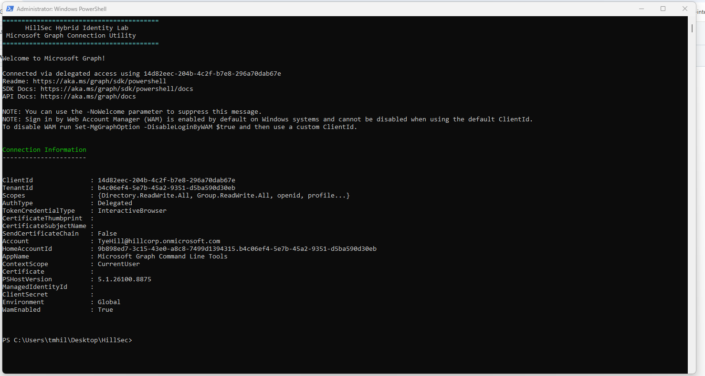
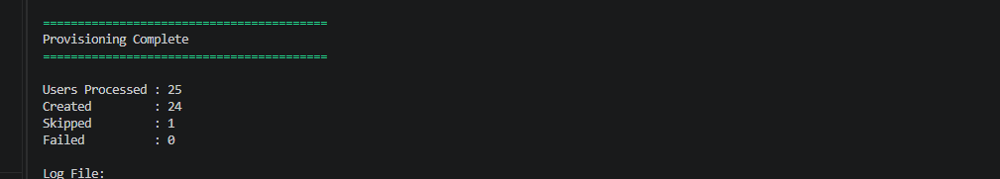
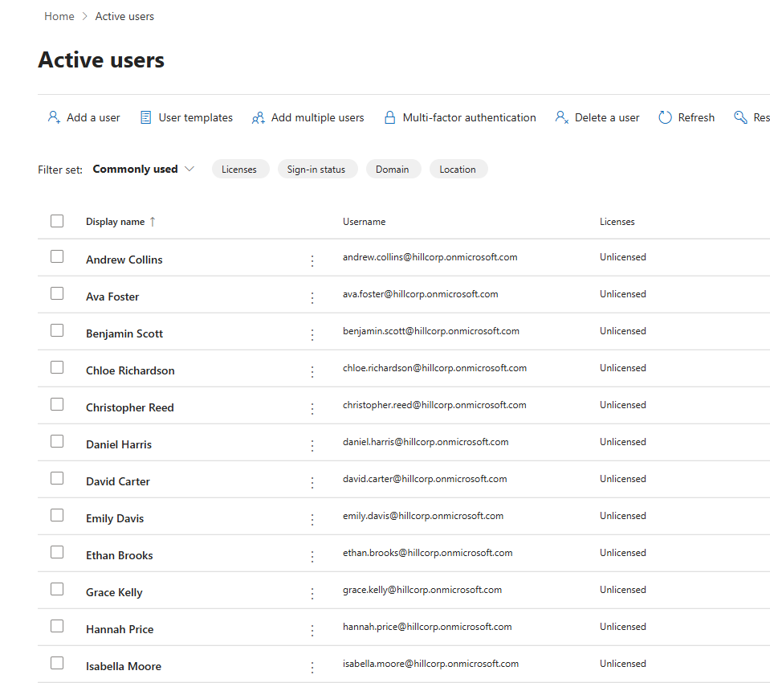
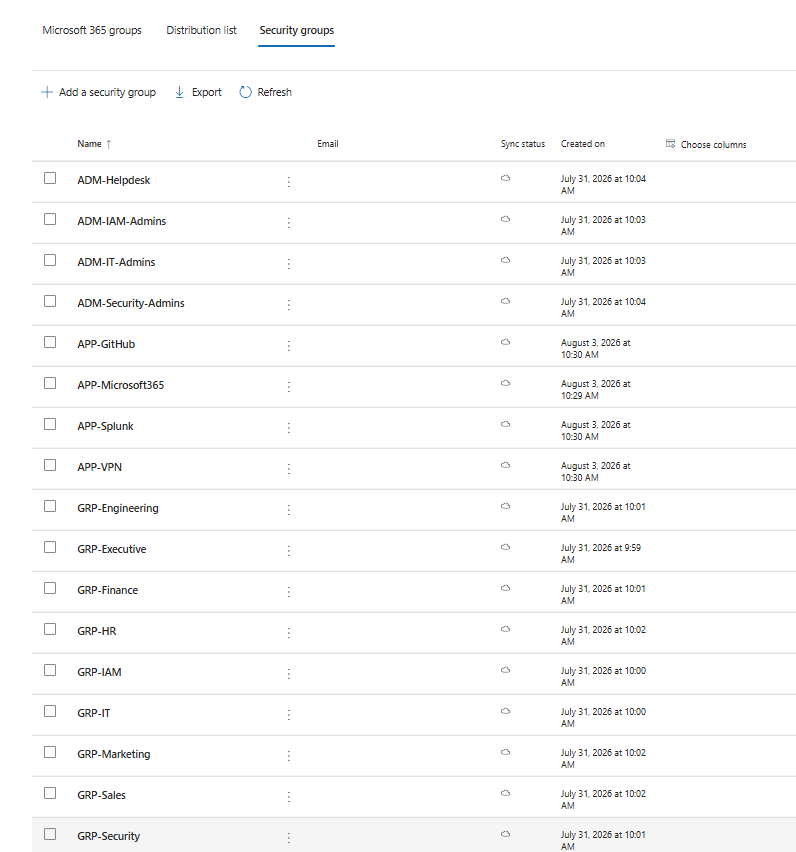
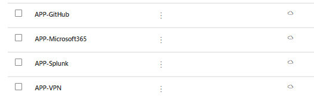
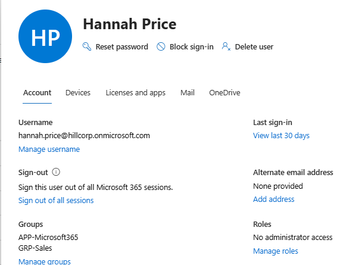
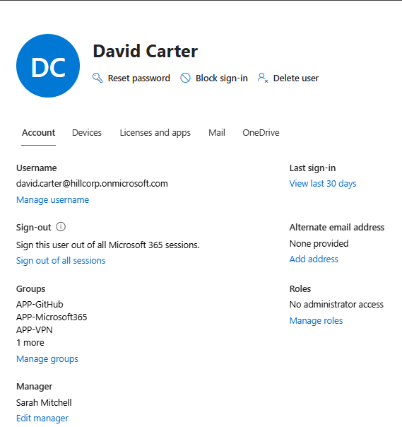

# Phase 4 – Authentication & Access Management

## Executive Summary

This phase focused on implementing authentication and access management within the HillSec Microsoft Entra ID environment through Microsoft Graph PowerShell automation.

Building upon the identity foundation and lifecycle planning established in previous phases, authentication and authorization processes were automated to simulate enterprise onboarding workflows. Identity provisioning, Role-Based Access Control (RBAC), application access assignments, and organizational reporting relationships were implemented using reusable PowerShell scripts and Microsoft Graph.

The completed implementation demonstrates how enterprise IAM teams automate user onboarding, access management, and identity administration while preparing the environment for future hybrid identity integration with Okta.

---

# Objectives

The objectives of this phase were to:

- Automate Microsoft Entra ID user provisioning.
- Implement Role-Based Access Control (RBAC).
- Assign department security groups.
- Assign administrative security groups.
- Assign application security groups.
- Configure organizational manager relationships.
- Standardize identity provisioning using Microsoft Graph PowerShell.
- Prepare the environment for hybrid identity federation.

---

# Technologies Used

| Technology | Purpose |
|------------|---------|
| Microsoft Entra ID | Cloud identity and access management |
| Microsoft Graph PowerShell SDK | Identity automation and administration |
| Microsoft Graph API | Directory provisioning and management |
| PowerShell 7 | Automation scripting |
| Visual Studio Code | Script development |
| Microsoft 365 Developer Tenant | Enterprise lab environment |

---

# Authentication Architecture

The HillSec authentication workflow simulates a modern enterprise identity provisioning process.

```text
              Identity Provisioning Matrix (CSV)
                           │
                           ▼
                Microsoft Graph PowerShell
                           │
                           ▼
                  Microsoft Graph API
                           │
                           ▼
                Microsoft Entra ID Tenant
                           │
         ┌─────────────────┼─────────────────┐
         ▼                 ▼                 ▼
      Users         Security Groups       Managers
```

---

# Microsoft Graph Automation

Authentication and access management tasks were automated using Microsoft Graph PowerShell.

Automation includes:

- Secure Microsoft Graph authentication
- Bulk user provisioning
- Identity attribute population
- Duplicate account detection
- Automated RBAC assignments
- Manager relationship configuration
- Execution logging

Automation scripts developed during this phase include:

| Script | Purpose |
|---------|----------|
| 01-Connect-MicrosoftGraph.ps1 | Authenticate to Microsoft Graph |
| 02-Test-ProvisioningFile.ps1 | Validate the provisioning CSV |
| 03-New-TestUser.ps1 | Provision a single test user |
| 04-BulkUserProvision.ps1 | Bulk provision employee identities |
| 05-Assign-Groups.ps1 | Assign department, administrative, and application security groups |
| 06-Assign-Managers.ps1 | Configure organizational reporting hierarchy |

---

# Automated Identity Provisioning

Identity provisioning is driven by the HillSec Identity Provisioning Matrix.

Each employee record contains standardized organizational attributes including:

- Employee Number
- Username
- Display Name
- Department
- Division
- Cost Center
- Manager
- Department Group
- Administrative Group
- Application Groups

During provisioning, the automation performs the following actions:

1. Reads employee information from the provisioning matrix.
2. Verifies whether the user already exists.
3. Creates new Microsoft Entra ID accounts.
4. Populates organizational identity attributes.
5. Records provisioning activity in execution logs.

This repeatable process ensures consistent identity creation while preventing duplicate accounts.

---

# Role-Based Access Control (RBAC)

Role-Based Access Control (RBAC) was implemented using Microsoft Entra ID security groups rather than assigning permissions directly to individual users.

## Department Security Groups

- GRP-Executive
- GRP-IAM
- GRP-IT
- GRP-Security
- GRP-Engineering
- GRP-Finance
- GRP-HR
- GRP-Marketing
- GRP-Sales

## Administrative Security Groups

- ADM-IAM-Admins
- ADM-IT-Admins
- ADM-Security-Admins
- ADM-Helpdesk

## Application Security Groups

- APP-Microsoft365
- APP-GitHub
- APP-Splunk
- APP-VPN

Group membership is automatically assigned based on the Identity Provisioning Matrix, ensuring users receive the correct organizational and application access during onboarding.

---

# Organizational Reporting Hierarchy

Manager relationships were automated using Microsoft Graph PowerShell.

Each employee's manager is defined within the Identity Provisioning Matrix and automatically configured during provisioning.

Implementing reporting relationships supports:

- Organizational visibility
- Identity governance
- Approval workflows
- Access reviews
- Microsoft 365 organizational features

---

# Validation

The completed implementation was validated by verifying:

- All 25 employee identities were successfully provisioned.
- User attributes were populated correctly.
- Department security groups matched the provisioning matrix.
- Administrative group assignments were correct.
- Application security groups were assigned successfully.
- Manager relationships reflected the organizational hierarchy.
- Duplicate user detection functioned correctly.
- Execution logs recorded provisioning activity.

---
# Implementation Evidence

The following screenshots demonstrate the successful implementation of authentication and access management within the HillSec Microsoft Entra ID environment.

## Microsoft Graph Authentication



**Figure 1.** Successful authentication to Microsoft Graph using the Microsoft Graph PowerShell SDK.

---

## Bulk User Provisioning



**Figure 2.** Automated provisioning of HillSec employee identities into Microsoft Entra ID.

---

## Microsoft Entra ID User Directory



**Figure 3.** HillSec employee identities successfully provisioned within Microsoft Entra ID.

---

## Security Groups



**Figure 4.** Department and administrative security groups supporting Role-Based Access Control (RBAC).

---

## Application Security Groups



**Figure 5.** Application security groups used to manage access to enterprise applications.

---

## Group Assignments



**Figure 6.** Automated assignment of department, administrative, and application security groups.

---

## Manager Relationship



**Figure 7.** Organizational reporting hierarchy configured through automated manager assignments.


---

# Lessons Learned

This phase reinforced several Identity and Access Management best practices:

- Microsoft Graph PowerShell enables repeatable identity lifecycle automation.
- RBAC simplifies administration by assigning permissions through security groups rather than individual users.
- Standardized identity attributes improve governance, reporting, and lifecycle management.
- Automation reduces manual provisioning effort and minimizes configuration errors.
- Manager relationships provide organizational context and support approval workflows.
- Execution logging improves operational visibility and troubleshooting.

---

# Next Phase

The next phase focuses on **Enterprise Application Integration**, where enterprise applications will be connected to the HillSec identity platform and access will be managed through security group assignments. Building upon the RBAC foundation established during this phase, application integrations will demonstrate how group memberships drive access to Microsoft 365, GitHub, Splunk, VPN resources, and additional enterprise services.
