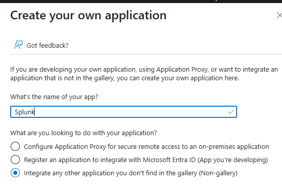
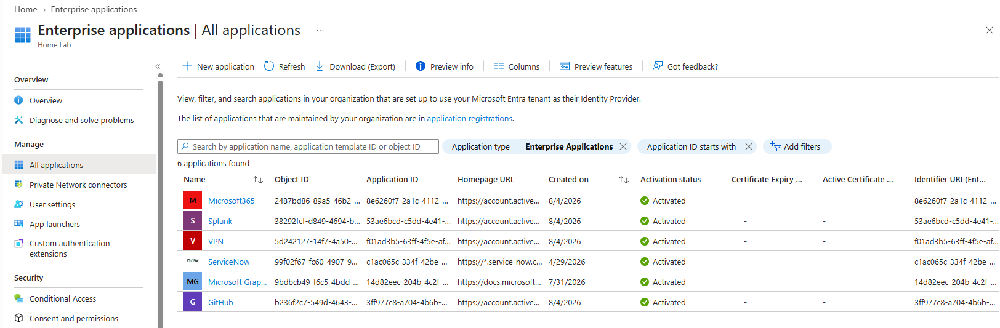
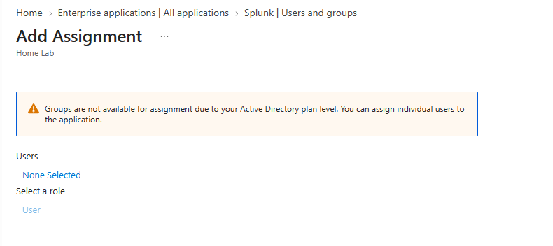

# Phase 5 – Enterprise Application Integration

## Executive Summary

This phase focused on extending the HillSec identity environment by integrating enterprise applications into Microsoft Entra ID. Enterprise Applications provide the foundation for application authentication, authorization, and future Single Sign-On (SSO) capabilities.

To simulate a modern enterprise Identity and Access Management (IAM) environment, four business applications were onboarded into Microsoft Entra ID using Enterprise Applications. These applications represent common business services and establish the framework for future federation, application access management, and identity governance.

---

# Objectives

The objectives of this phase were to:

- Integrate enterprise applications into Microsoft Entra ID.
- Demonstrate enterprise application onboarding.
- Implement an application access strategy using Role-Based Access Control (RBAC).
- Prepare applications for future Single Sign-On (SSO).
- Establish the foundation for hybrid identity integration with Okta.

---

# Enterprise Application Strategy

Enterprise Applications represent cloud and on-premises applications that users access through Microsoft Entra ID.

Rather than assigning application access directly to users, the HillSec environment follows a Role-Based Access Control (RBAC) model where application access is associated with dedicated security groups.

This approach improves scalability, simplifies administration, and aligns with enterprise IAM best practices.

---

# Enterprise Applications Implemented

The following Enterprise Applications were created during this phase.

| Application | Business Purpose |
|--------------|------------------|
| Microsoft365 | Productivity and collaboration platform |
| GitHub | Source code management and version control |
| Splunk | Security Information and Event Management (SIEM) |
| VPN | Secure remote access |

---

# RBAC Application Mapping

Application access is designed using dedicated security groups.

| Security Group | Enterprise Application | Business Purpose |
|----------------|------------------------|------------------|
| APP-Microsoft365 | Microsoft365 | Productivity and collaboration |
| APP-GitHub | GitHub | Source code management |
| APP-Splunk | Splunk | Security monitoring (SIEM) |
| APP-VPN | VPN | Secure remote access |

This RBAC model separates identity from permissions by assigning access through security groups instead of directly to individual users.

---

# Enterprise Application Onboarding

Each Enterprise Application was created using Microsoft Entra ID's **Create your own application** option.

The onboarding process consisted of:

1. Creating a new Enterprise Application.
2. Assigning a standardized application name.
3. Verifying successful deployment.
4. Validating application availability within Microsoft Entra ID.
5. Preparing the application for future authentication and authorization scenarios.

This standardized workflow demonstrates how IAM administrators onboard enterprise applications into an identity platform.

---

# Licensing Considerations

### Lab Note

Microsoft Entra ID Premium licensing is required to assign security groups directly to Enterprise Applications.

The HillSec environment uses a standard Microsoft Entra tenant, which does not include this capability. As a result, application onboarding was successfully demonstrated while the intended RBAC design was documented rather than enforced through direct group assignments.

This implementation accurately reflects enterprise architecture while acknowledging the licensing limitations of the lab environment.

---

# Validation

The implementation was validated by confirming:

- Four Enterprise Applications were successfully created.
- Applications appear within the Microsoft Entra Enterprise Applications portal.
- Naming conventions remained consistent.
- Application security groups align with the Identity Provisioning Matrix.
- The environment is prepared for future SSO and federation scenarios.

---

# Implementation Evidence

## Enterprise Application Creation

**Figure 1.** Creating a custom Enterprise Application using Microsoft Entra ID.

---

## Enterprise Applications Overview

**Figure 2.** Enterprise Applications configured within the HillSec Microsoft Entra ID environment.

---

## Licensing Limitation

**Figure 3.** Microsoft Entra ID licensing limitation preventing direct security group assignments to Enterprise Applications.

---

# Lessons Learned

This phase reinforced several Identity and Access Management best practices:

- Enterprise Applications provide centralized application access management.
- RBAC simplifies authorization by assigning permissions through security groups.
- Standardized application onboarding improves consistency and scalability.
- Licensing requirements should be evaluated when designing enterprise IAM solutions.
- Documenting implementation limitations distinguishes lab constraints from production architecture.

---

# Next Phase

The next phase focuses on **Hybrid Identity Integration**, where Microsoft Entra ID and Okta will be integrated to demonstrate identity federation, Single Sign-On (SSO), and modern authentication protocols including SAML and OpenID Connect (OIDC).
