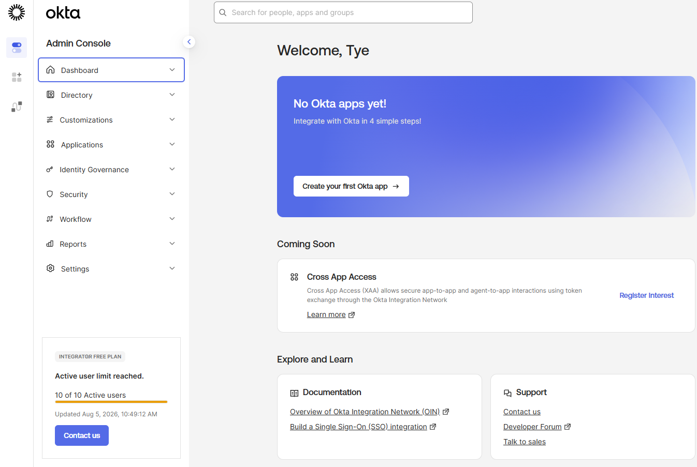
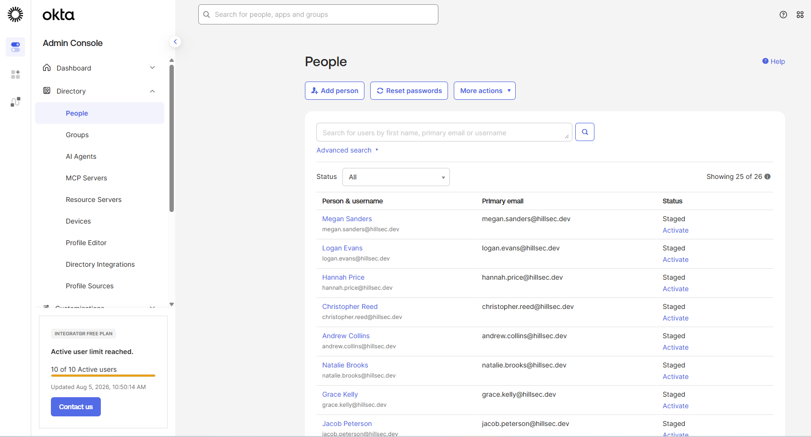
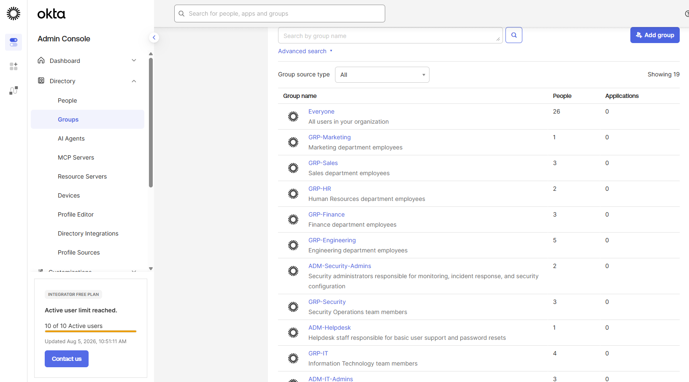
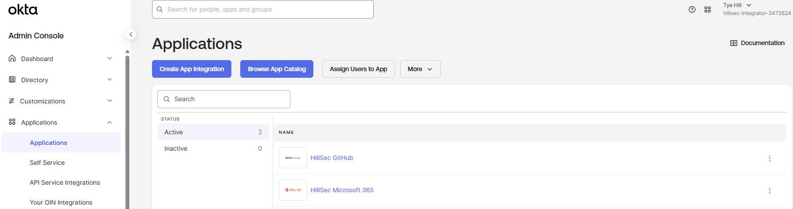
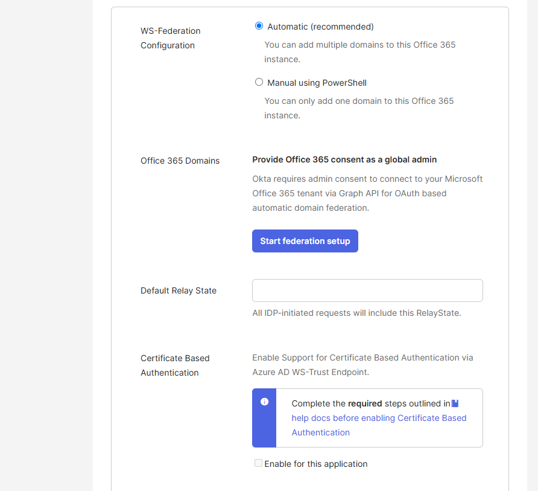

# Phase 6 – Hybrid Identity Integration

## Executive Summary

This phase focused on extending the HillSec Identity and Access Management (IAM) environment into a hybrid identity architecture by integrating Okta Workforce Identity Cloud with Microsoft Entra ID.

Okta was implemented as the workforce identity platform responsible for managing employee identities and enterprise application assignments, while Microsoft Entra ID provided identity management for Microsoft services, Role-Based Access Control (RBAC), Enterprise Applications, and Microsoft Graph automation.

The integration demonstrates how organizations leverage multiple identity platforms to provide centralized authentication, simplified administration, and secure access to enterprise resources.

---

# Objectives

The objectives of this phase were to:

- Demonstrate a hybrid identity architecture.
- Configure workforce identities within Okta.
- Integrate Microsoft Office 365 into Okta.
- Evaluate federation using WS-Federation.
- Demonstrate enterprise application integration across identity platforms.
- Prepare the environment for future Single Sign-On (SSO).

---

# Hybrid Identity Architecture

The HillSec environment models a modern enterprise identity architecture consisting of multiple identity platforms working together.

Within this environment:

- Okta functions as the workforce identity platform.
- Microsoft Entra ID manages Microsoft identities and enterprise resources.
- Microsoft Graph PowerShell automates user provisioning and administrative tasks.
- Enterprise Applications provide centralized application access.
- RBAC groups simplify authorization through group membership.

This layered approach reflects enterprise IAM deployments where multiple identity providers coexist to support different business requirements.

---

# Okta Workforce Identity

Okta serves as the primary workforce identity platform within the HillSec environment.

Configured components include:

- Workforce user directory
- Department groups
- Administrative groups
- Application assignments
- GitHub enterprise application
- Microsoft Office 365 enterprise application

These components provide centralized identity administration while preparing the environment for future federation scenarios.

---

# Microsoft Entra ID Integration

Microsoft Entra ID extends workforce identities into the Microsoft ecosystem.

Implemented capabilities include:

- Microsoft Graph automation
- Automated user provisioning
- Automated RBAC group assignments
- Manager hierarchy
- Enterprise Applications
- Identity lifecycle management

Together these services demonstrate how Microsoft Entra ID provides centralized identity governance and access management.

---

# Federation Strategy

Hybrid identity environments frequently rely on federation protocols such as WS-Federation, SAML, and OpenID Connect (OIDC) to provide Single Sign-On (SSO).

During implementation:

- The Microsoft Office 365 application was added to Okta.
- WS-Federation was selected as the authentication protocol.
- Automatic and manual federation workflows were evaluated.

To preserve the stability of the shared Microsoft Entra ID lab environment, full federation was intentionally not completed. This demonstrates the configuration process while avoiding changes to the existing authentication infrastructure.

---

# Identity Flow

The HillSec hybrid identity environment follows the identity lifecycle shown below.

```text
Oracle HR (CSV Simulation)
          │
          ▼
       Workforce Identity
          │
          ▼
         Okta
          │
 ┌────────┴────────┐
 ▼                 ▼
GitHub      Microsoft Office 365
                     │
                     ▼
           Microsoft Entra ID
                     │
     ┌───────────────┼────────────────┐
     ▼               ▼                ▼
Microsoft Graph   RBAC Groups   Enterprise Apps
```

This architecture demonstrates how workforce identities progress from onboarding through authentication, authorization, and enterprise application access.

---

# Validation

The implementation was validated by confirming:

- Workforce users exist within Okta.
- Department and administrative groups are configured.
- GitHub and Microsoft Office 365 applications were successfully added.
- Microsoft Entra ID remains operational.
- Federation workflows were successfully evaluated.
- The hybrid identity architecture accurately reflects enterprise IAM design.

---

# Implementation Evidence

## Okta Dashboard



**Figure 1.** Okta Workforce Identity Cloud administrative dashboard.

---

## Workforce Users



**Figure 2.** Workforce identities configured within Okta.

---

## RBAC Groups



**Figure 3.** Department and administrative groups supporting Role-Based Access Control.

---

## Enterprise Applications



**Figure 4.** GitHub and Microsoft Office 365 applications configured within Okta.

---

## Federation Configuration



**Figure 5.** WS-Federation configuration evaluated for Microsoft Office 365 integration.

---

# Lessons Learned

This phase reinforced several Identity and Access Management concepts:

- Hybrid identity environments frequently leverage multiple identity platforms.
- Federation enables centralized authentication across enterprise applications.
- Enterprise identity solutions should separate authentication from authorization.
- Planning federation carefully helps avoid unintended authentication changes.
- Hybrid IAM architectures improve scalability while supporting diverse business requirements.

---

# Next Phase

The final phase of the HillSec project focuses on **Security Monitoring & Validation**, where identity events, authentication activity, logging, and administrative actions will be reviewed to validate the completed IAM environment.
