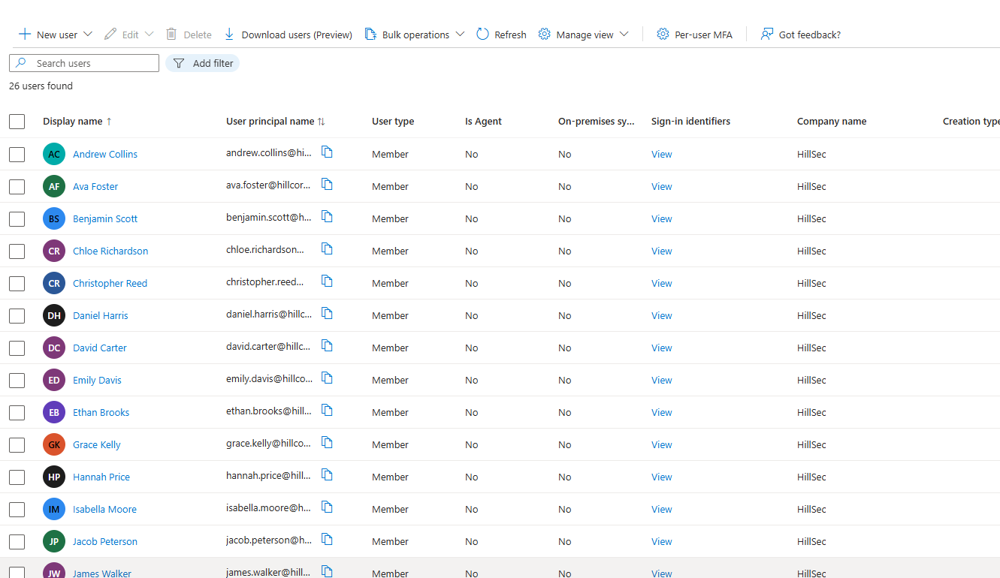
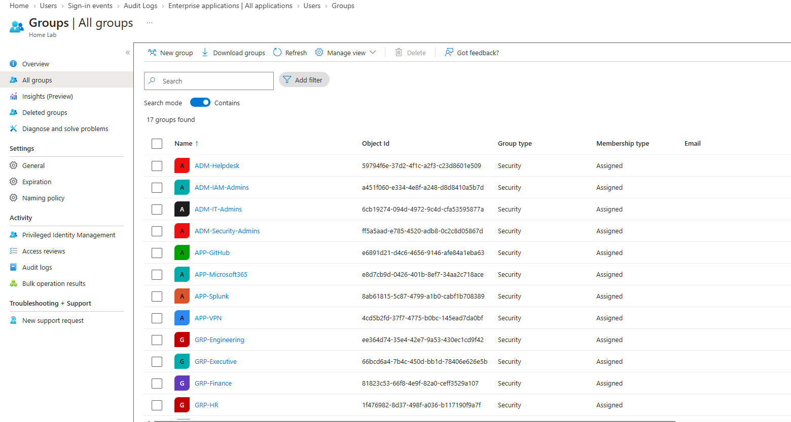
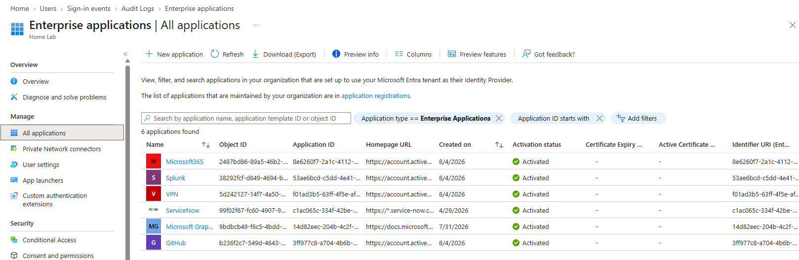
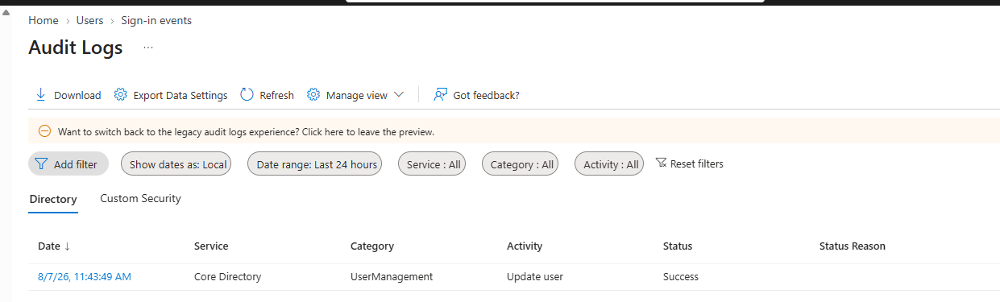
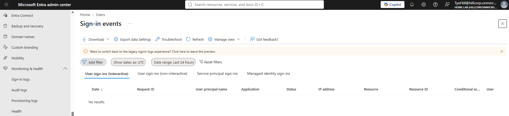

# Phase 7 – Security Monitoring & Validation

## Executive Summary

The final phase of the HillSec Hybrid Identity Lab focused on validating the completed Identity and Access Management (IAM) environment through Microsoft Entra ID monitoring capabilities. Identity security extends beyond user provisioning and access management by providing administrators with visibility into authentication events, directory changes, and administrative activity.

Microsoft Entra ID monitoring features were reviewed to validate the successful implementation of workforce identities, Role-Based Access Control (RBAC), enterprise applications, and directory management. Together, these capabilities demonstrate how organizations monitor and verify the health and security of enterprise identity environments.

---

# Objectives

The objectives of this phase were to:

- Review Microsoft Entra ID monitoring capabilities.
- Validate workforce identities and RBAC configuration.
- Verify Enterprise Application deployment.
- Review Microsoft Entra audit logs.
- Review Microsoft Entra sign-in monitoring.
- Confirm the successful implementation of the HillSec IAM environment.

---

# Security Monitoring Strategy

Identity platforms provide continuous visibility into authentication events, administrative actions, and directory changes. Microsoft Entra ID includes built-in monitoring features that allow administrators to investigate identity activity and validate security operations.

The monitoring strategy implemented during this phase focused on:

- Workforce identity validation
- RBAC verification
- Enterprise Application validation
- Audit logging
- Authentication monitoring

These capabilities provide the foundation for identity governance, security investigations, and compliance reporting.

---

# Audit Logging

Microsoft Entra ID Audit Logs record administrative changes occurring throughout the identity environment.

Examples include:

- User creation
- Group management
- Enterprise Application configuration
- Administrative updates
- Directory modifications

Reviewing audit events confirms that identity administration activities are recorded and available for future investigation.

---

# Sign-in Monitoring

Microsoft Entra ID Sign-in Logs provide visibility into user authentication activity.

These logs assist administrators by identifying:

- Interactive sign-ins
- Failed authentication attempts
- Authentication methods
- User locations
- Sign-in status
- Identity-related investigations

During validation, the Sign-in Logs interface was reviewed to confirm monitoring capabilities within the HillSec environment. While no interactive sign-in events were recorded during the observation period, the monitoring functionality was successfully validated.

---

# Identity Validation

The completed IAM environment was validated by confirming:

- Workforce identities were successfully provisioned.
- Department and administrative RBAC groups were configured.
- Enterprise Applications were available within Microsoft Entra ID.
- Audit logging was operational.
- Sign-in monitoring was available.
- Microsoft Graph automation successfully provisioned and managed directory objects.

These validation steps confirm that the HillSec environment accurately models enterprise identity administration workflows.

---

# Implementation Evidence

## Microsoft Entra Users

**Figure 1.** Workforce identities successfully provisioned within Microsoft Entra ID.

---

## Microsoft Entra Groups

**Figure 2.** Role-Based Access Control (RBAC) groups configured within Microsoft Entra ID.

---

## Enterprise Applications

**Figure 3.** Enterprise Applications configured within Microsoft Entra ID.

---

## Audit Logs

**Figure 4.** Microsoft Entra ID audit logs validating administrative activity.

---

## Sign-in Logs

**Figure 5.** Microsoft Entra ID sign-in monitoring interface used to review authentication activity.

---

# Lessons Learned

This phase reinforced several Identity and Access Management principles:

- Identity monitoring is essential for maintaining security and operational visibility.
- Audit logs provide accountability for administrative actions and directory changes.
- Sign-in logs assist with authentication monitoring and incident investigation.
- RBAC and Enterprise Applications should be regularly validated to ensure accurate authorization.
- Identity automation and monitoring together provide a strong foundation for enterprise IAM operations.

---

# Project Conclusion

The HillSec Hybrid Identity Lab demonstrates the implementation of a modern Identity and Access Management environment using Microsoft Entra ID and Okta Workforce Identity Cloud.

Throughout the project, workforce identities were provisioned, organizational structures were established through Role-Based Access Control (RBAC), enterprise applications were integrated, identity lifecycle processes were automated using Microsoft Graph PowerShell, and hybrid identity concepts were implemented through Okta and Microsoft Entra ID.

The completed environment models many of the core identity administration tasks performed by enterprise IAM teams while providing a hands-on platform for continued learning and future enhancements.
